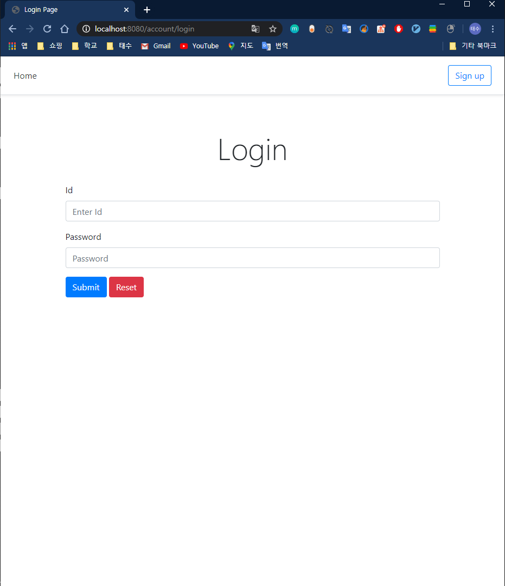
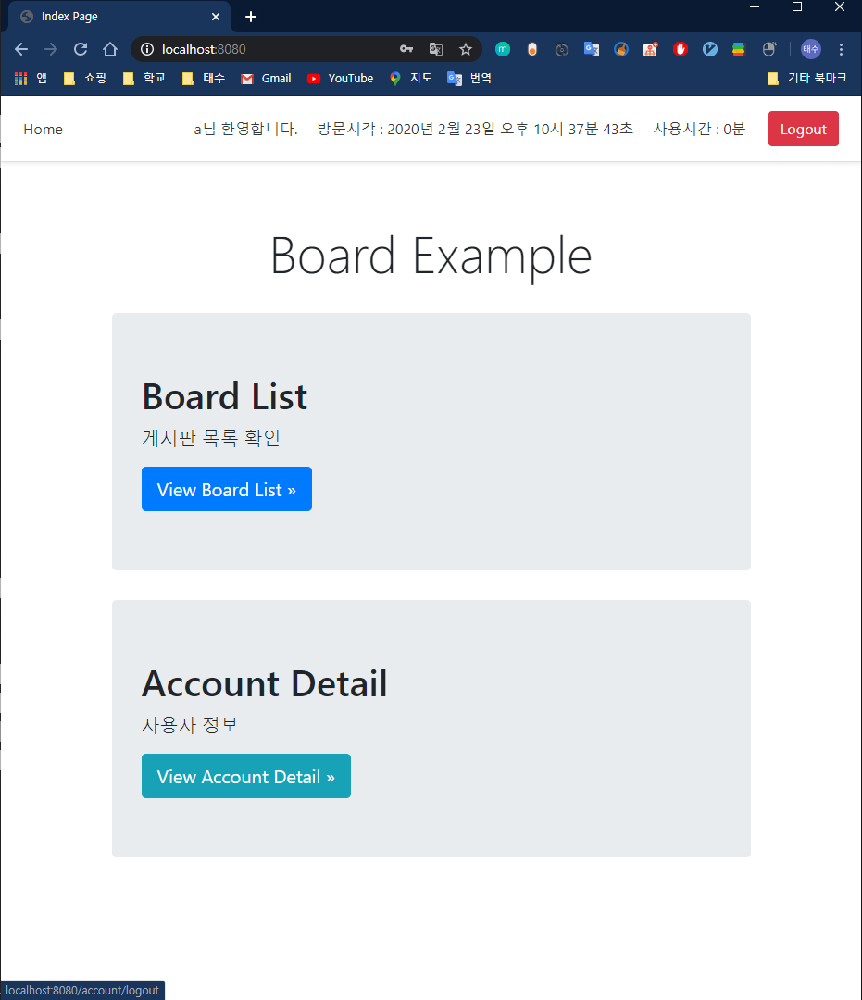
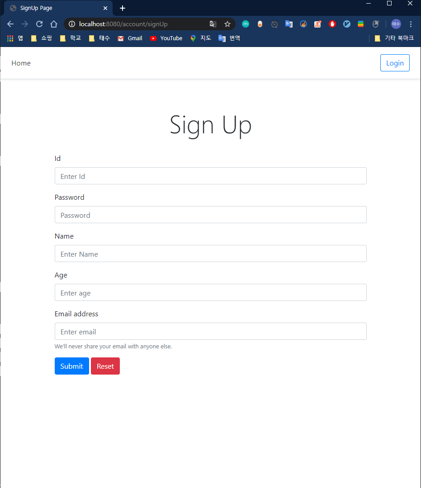
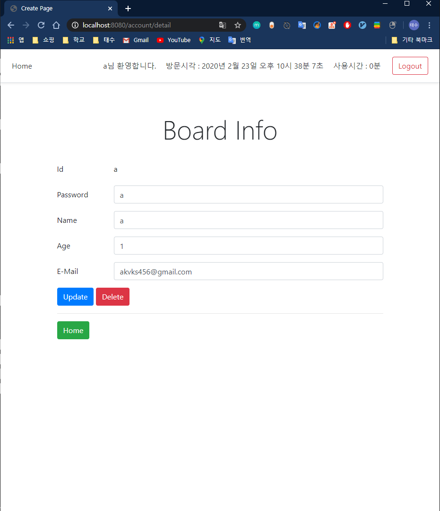
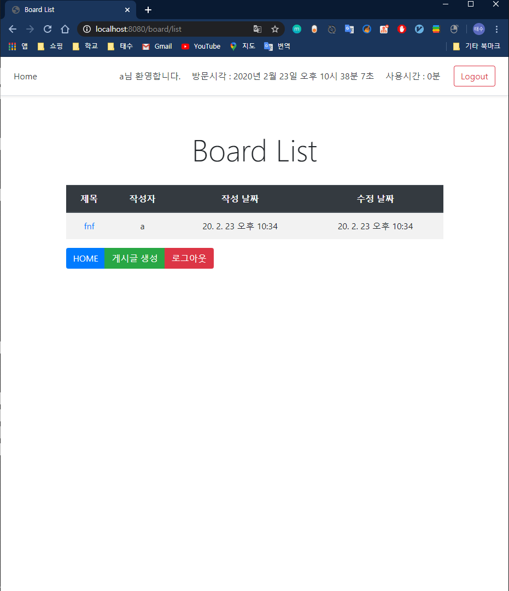
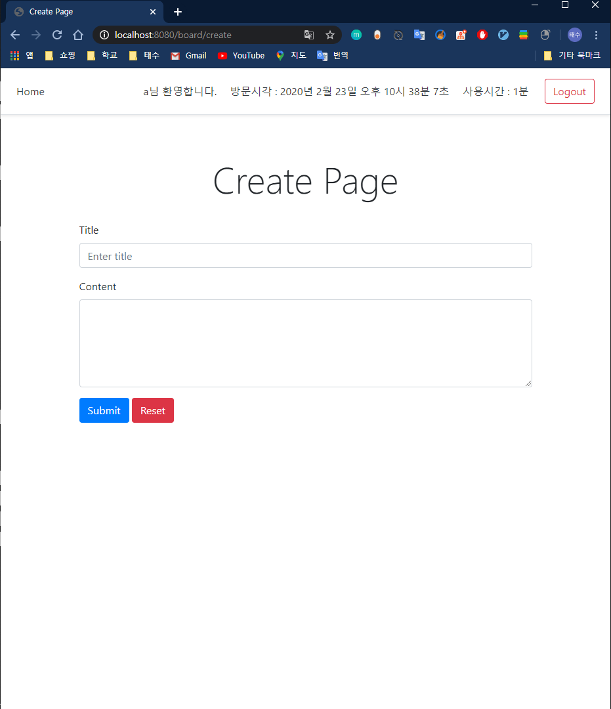
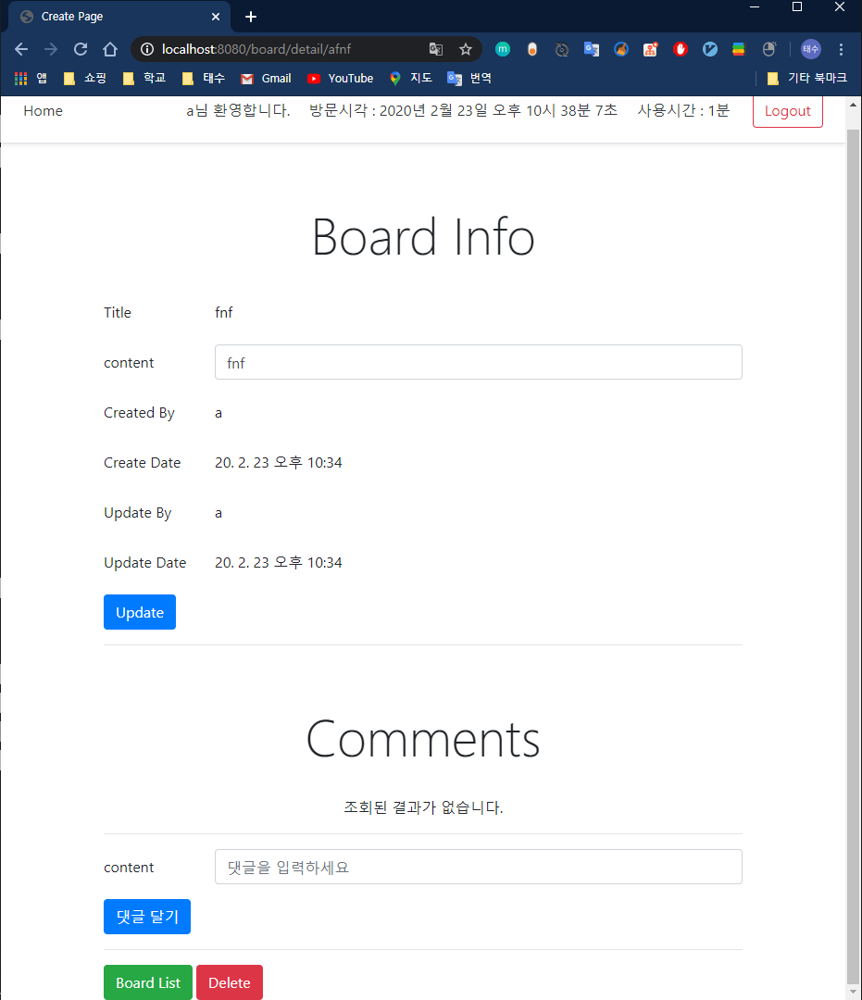

# springboot_board
게시판 예제

기능
  - Account
    - 로그인
    
      
    
    - 로그 아웃 및 기본 index 화면
    
      
    
    - 회원 가입
    
      
    
    - 회원 정보 변경, 회원 삭제
    
      
  - Board
    - 게시판 목록
    
      
    
    - 게시판 생성
    
      
    
    - 게시판 수정, 삭제   |   댓글 추가, 수정, 삭제
    
      